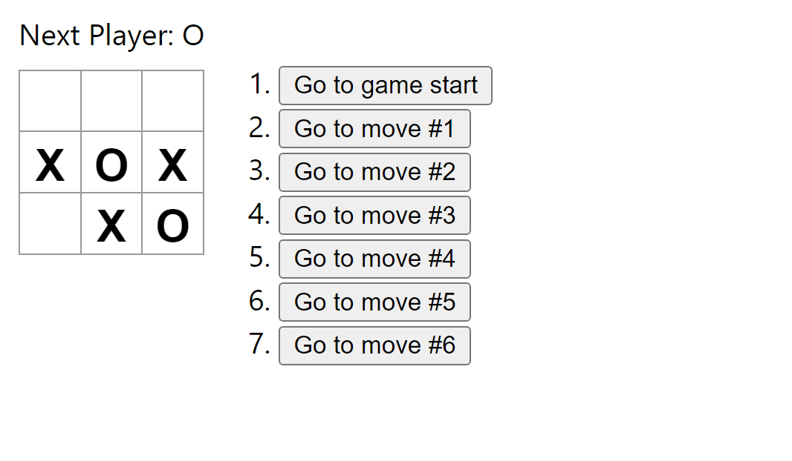
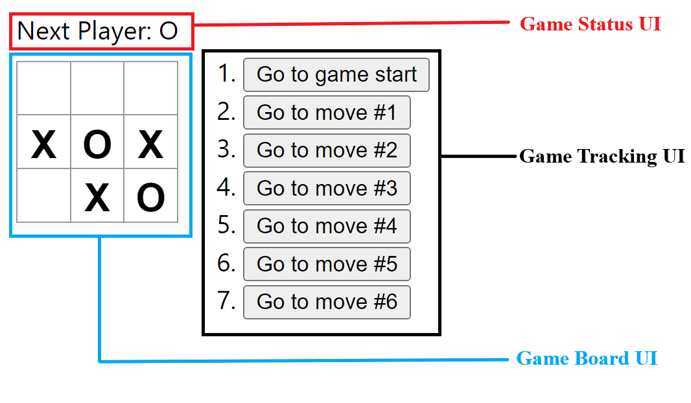
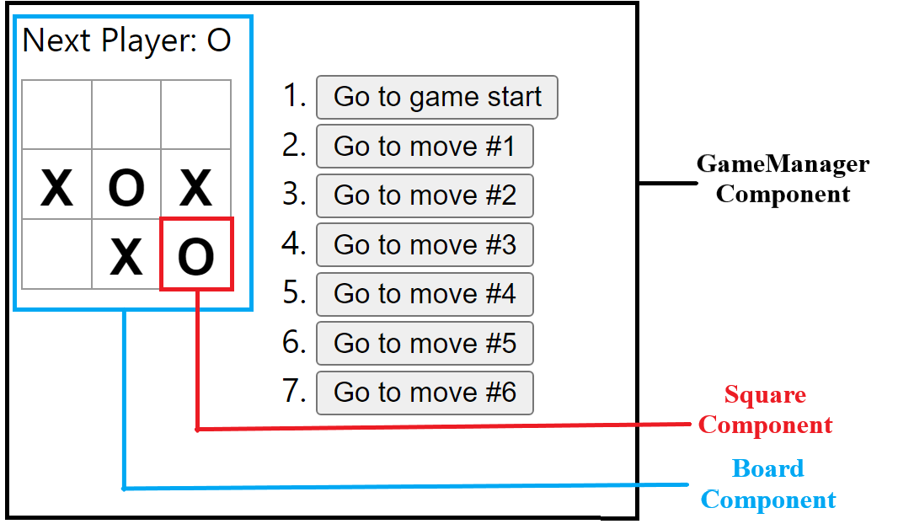
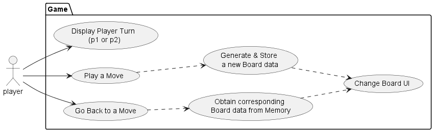

  
   
  
  

# Project Name: Simple React TicTacToe Program
Experience the classic game of TicTacToe on the web with an added twist of game backtracking. Step into the past with interactive buttons that allow you to revisit previous game states, enhancing your strategic gameplay.  

# Project ScreenShot

  

# Project UI's

  

# Project Components

  

# Project Use-Case

  

# Project Description

